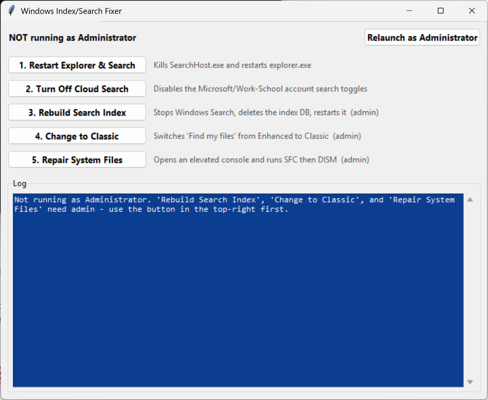
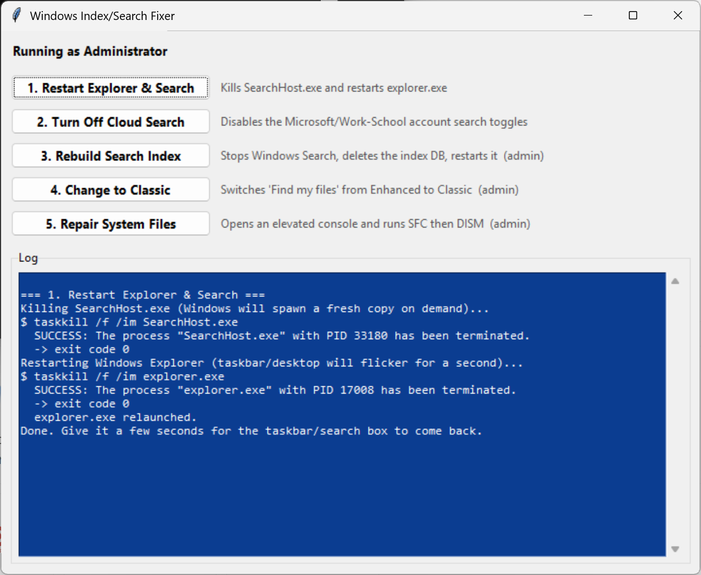

# 🔍 Windows Search/Index Fixer

A small, single-file **Tkinter** control panel that automates the most common fixes for slow or broken **Windows Search / Cortana indexing** on Windows 10 & 11 — no more digging through nested Settings pages by hand. 🛠️

Every button shows you exactly what it's about to run (with a confirmation prompt ✅❌) and streams live command output to an on-screen log, so nothing happens silently.

<p align="center">
  
  
</p>

---

## ✨ Features

| Button | What it does |
|---|---|
| 🔁 **Restart Explorer & Search** | Kills `SearchHost.exe` and restarts `explorer.exe` — the quick "turn it off and on again" fix |
| ☁️ **Turn Off Cloud Search** | Disables the *Microsoft account* and *Work/School account* toggles under **Search my accounts**, so results stop pulling in OneDrive/cloud content |
| 🧱 **Rebuild Search Index** | Stops the Windows Search service, deletes the corrupted index database, and restarts the service so Windows rebuilds it from scratch |
| 🗂️ **Change to Classic** | Switches **Find my files** from *Enhanced* (indexes your whole PC) to *Classic* (Documents, Pictures, Desktop only) for snappier search |
| 🩹 **Repair System Files** | Opens an elevated console and runs `SFC /SCANNOW`, then `DISM /Online /Cleanup-Image /RestoreHealth` |

Plus:
- 🔐 **Admin awareness** — the app tells you up front whether it's elevated, and a one-click **Relaunch as Administrator** button handles the UAC prompt for you.
- ⚠️ **Confirmation dialogs** — every action explains what it's about to change before it touches anything.
- 📜 **Live blue-on-white log console** — every command that runs (and its output) is printed in real time.

---

## 📋 Requirements

- 🪟 Windows 10 (version 2015+) or Windows 11
- 🐍 Python 3 with Tkinter (this ships with the standard [python.org](https://www.python.org/downloads/) installer — no `pip install` needed, everything used is in the standard library)
- 🔑 Administrator rights for the **Rebuild Search Index**, **Change to Classic**, and **Repair System Files** actions

---

## 🚀 Getting Started

1. Clone or download this repository:
   ```bash
   git clone https://github.com/moturkmani/Win11GlitchyIndexerFix.git
   cd Win11GlitchyIndexerFix
   ```
2. Run the app:
   ```bash
   python win11fixes.py
   ```
3. If a button tells you it needs admin rights, click **Relaunch as Administrator** in the top-right corner (or right-click the script and choose *Run as administrator*).

---

## ⚠️ Important Notes Before You Use This

- This tool edits your **registry** and stops/restarts a **Windows service**. It's built from publicly documented, standard troubleshooting techniques, but as with any script that touches the registry, it's worth being careful.
- 💾 **Create a System Restore Point first** (`Start` → *"Create a restore point"*), especially before using **Change to Classic** (it modifies registry key permissions) or **Repair System Files**.
- 🧭 **Change to Classic** relies on a permission-ownership workaround that isn't officially documented by Microsoft. If it doesn't visibly flip the toggle in Settings, open **Settings → Privacy & security → Search** and switch it by hand.
- ⏱️ **Rebuild Search Index** and **Repair System Files** can each take anywhere from several minutes to over an hour depending on your PC — the app won't freeze, but give the background/console windows time to finish.
- 🔍 Nothing here is hidden — every command is printed to the log pane before it runs, so you always know exactly what happened.

---

## 🖼️ Screenshots

Screenshots live in [`assets/`](assets) — see the preview at the top of this README.

---

## 🤝 Contributing

Issues and pull requests are welcome! If you find a Windows build where one of the registry paths doesn't behave as expected, please open an issue with your Windows version (`winver`) so it can be documented.

---

## 📄 License

This project is licensed under the [MIT License]— do whatever you like with it, just keep the copyright notice. 🙌

---

## 🙏 Disclaimer

This software is provided as-is, with no warranty of any kind. It automates changes to your registry, search index, and system files — use at your own risk, and always keep backups.
